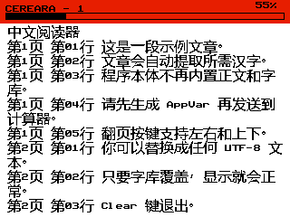

### CERE：TI-84 Plus CE 中文阅读器

#### 运行时 AppVar

- 支持加载多个文章 AppVar，主菜单会扫描头部为 `CART` 的 AppVar。
- 每个文章 AppVar 头部会记录其“文章字形 AppVar”名称（默认 `CARTFNT`）。
- 程序会优先加载文章字形，并尝试加载基础字形 `CEREFNT` 作为回退字库。
- 阅读器采用流式分页，RAM 仅保留当前页缓存。

运行前请发送以下文件到计算器：
- `CERE.8xp`
- 每篇文章对应的文章 AppVar（例如 `CEREART.8xv`）
- 每篇文章对应的文章字形 AppVar（例如 `CARTFNT.8xv`）
- 基础字形 AppVar（推荐发送 `CEREFNT.8xv`，用于界面字形与缺字回退）

#### 构建计算器程序

执行 `build.bat`，会在 `bin/` 目录下生成 `CERE.8xp`。

#### 在电脑上生成文章 + 字形 AppVar

如果你使用 Windows，可以直接使用 Release 中给定的 `generate_appvars.exe`，双击运行，如果你不明白请不要使用“生成基本字形”。

1. 安装 Python 依赖
- `python -m pip install -r tools/requirements.txt`

2. 准备 UTF-8 编码文章文本（例如 `assets/article.txt`）

3. 生成文章 + 文章字形 AppVar：
- `python tools/generate_appvars.py --article assets/article.txt --font C:\Windows\Fonts\simsun.ttc --out-dir out --article-name CEREART --font-name CARTFNT`

图形化模式：
- `python tools/generate_appvars.py`
- 或 `python tools/generate_appvars.py --gui`
- 可在界面里选择文章、字体、输出目录，并实时查看字体预览。

仅生成基础字形：
- `python tools/generate_appvars.py --base-only --font C:\Windows\Fonts\simsun.ttc --out-dir out --base-font-name CEREFNT`

你可以重复执行命令并更换 `--article-name` / `--font-name` 来添加更多文档。

生成文件：
- `out/<ARTICLE_NAME>.bin`
- `out/<ARTICLE_NAME>.8xv`
- `out/<FONT_NAME>.bin`
- `out/<FONT_NAME>.8xv`

如执行了 `--base-only`，还会生成：
- `out/<BASE_FONT_NAME>.bin`
- `out/<BASE_FONT_NAME>.8xv`

4. 将 `CERE.8xp` 与所有需要的 `.8xv` 一并发送到计算器。

#### 生成器行为说明

- 自动收集文章中的非 ASCII 字符并栅格化为 `16x16` 点阵。
- 文章 AppVar 中保存正文、章节目录和文章字形 AppVar 名称。
- 章节标记：
- `!#Chapter Title#!`：写入带标题章节，并将标题插入正文。
- `!##!`：写入无标题章节，显示为 `(untitled)`。
- 文章字形 AppVar 仅保存当前文章所需字形。

这种方案可显著减小程序体积，仅存储当前文章实际需要的字形。
阅读器按页流式读取 AppVar，仅保留当前页缓存到 RAM。

#### 阅读状态持久化

- 每篇文档的最后阅读位置保存在 AppVar CEREPOS。
- 每篇文档的书签保存在 AppVar CEREBM。
- 重新打开文档时会自动恢复到上次阅读位置。

#### 控制

- 主菜单：上/下或左/右选择，2nd/Enter 打开，Alpha 刷新列表，Clear 退出
- 关于页：在菜单选 About 后按 2nd/Enter 进入，Alpha/Clear 返回
- 阅读页：左/右/上/下翻页
- 阅读页：打开后 5 秒内，2nd/Enter 连按两次跳到第一页
- 阅读页：VARS 在当前位置切换书签
- 阅读页：STAT 打开跳转面板（书签/章节）
- 阅读页：Alpha/Clear 返回菜单
- 跳转面板：上/下选择，左/右切换标签，2nd/Enter 跳转，Clear/Alpha/STAT 返回

#### 待办事项

- [x] 流式分页
- [x] 阅读进度显示
- [x] 阅读位置自动记忆（CEREPOS）
- [x] 每文档书签增删（CEREBM）
- [x] 章节目录读取与跳转面板（STAT）
- [x] 生成器图形化
- [ ] 按页码跳转
- [ ] 最近阅读文档列表
- [ ] 书签重命名/删除确认/排序
- [ ] 生成器字体下拉搜索过滤
- [ ] 生成器产物缺字/超限/章节标记警告
